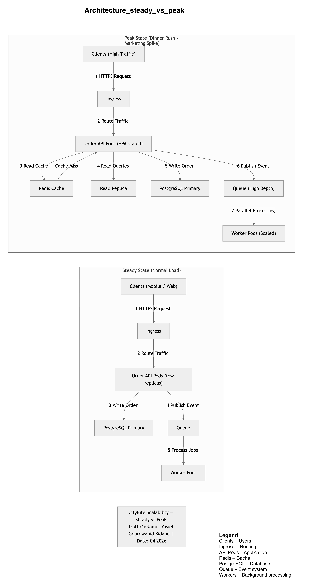

# CityBite at Peak — Scalability Architecture (Lecture 10)

## Student: Yosief Gebrewahid Kidane 
## Course: Architecture Strategy  
## Assignment: Lecture 10 — Scalability  
## Date: 2026-04-23 

---

# 1. Overview

This project explains how CityBite can handle heavy traffic during peak times like dinner rushes or marketing campaigns. The focus is on keeping the system fast, stable, and scalable using cloud-native patterns like caching, queues, and horizontal scaling.

---

# 2. System Overview

CityBite runs on:

- Kubernetes (Order API + workers)
- PostgreSQL (managed database)
- Redis (cache)
- Object storage (menu images)
- Message queue (async tasks like notifications)

---

# 3. Key Ideas

## Hot paths
We avoid slow full-table scans by indexing on `restaurant_id`, so each restaurant only reads its own data.

## Caching
Redis is used for frequently accessed data like active orders, reducing database load during busy periods.

## Queues
Notifications (SMS, email, push) are sent through a queue so the API doesn’t wait on slow external services.

## Scaling
- API pods scale horizontally using HPA  
- Workers scale based on queue size  
- Database stays managed outside the cluster with replicas for reads  

---

# 4. Steady vs Peak

**Normal traffic:**
- Low cache usage  
- Small number of pods  
- Direct DB reads/writes  

**Peak traffic:**
- More API + worker pods  
- Redis cache heavily used  
- Queue absorbs traffic spikes  
- Read replicas reduce DB pressure  

---

# 5. Key Decisions

| Area | Choice | Why |
|------|--------|-----|
| API | Horizontal scaling | Stateless and easy to scale |
| DB | Managed Postgres | Reliable and consistent |
| Notifications | Queue + workers | Prevents blocking requests |
| Cache | Redis | Reduces DB load |
| Storage | Object storage | Scales easily |

---

# 6. Diagram

Shows how requests move through the system and how scaling kicks in during peak load.
