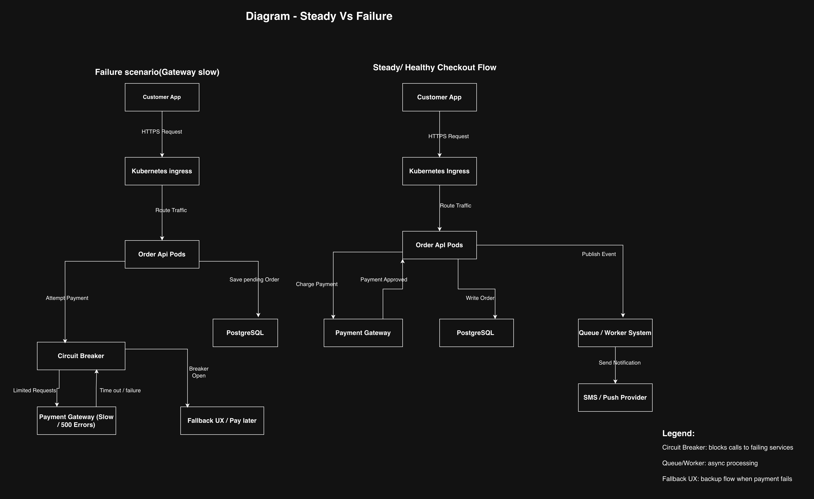

# Assignment 11 — CityBite Availability & Services

## Overview

This assignment focuses on how CityBite maintains **system availability** under failures such as payment gateway outages, database pressure, and cascading retry storms. The design is based on Kubernetes deployment (Lecture 9), scalability patterns (Lecture 10), and availability techniques (Lecture 11).

---

## System Summary

CityBite runs on:
- Kubernetes (Order API + workers)
- PostgreSQL (managed database)
- Object storage (menu images)
- External services (Payment, SMS, Maps APIs)

Key challenge: **external dependency failures and traffic spikes during peak hours.**

---

## Part 1 — Services & SLOs

- Identified internal components vs external services
- Defined critical dependencies (Payment Gateway, PostgreSQL)
- SLI: successful order checkout rate
- SLO: 99.5% monthly availability
- Error budget used to control releases and feature rollouts

---

## Part 2 — Monitoring & Failure Handling

- Liveness probe: ensures process is running
- Readiness probe: ensures service can handle traffic
- Synthetic monitoring: external order test flow
- Alerts:
  - High 5xx error rate
  - Database saturation

### Failure Handling
- Circuit breaker prevents retry storms
- Timeouts and bulkheads isolate dependencies
- Graceful fallback (queue orders / pay later)

---

## Part 3 — Replication & Availability

- PostgreSQL uses primary + read replicas
- Strong consistency for orders/payments
- Eventual consistency for reads and reporting
- Risk: replication lag and split-brain during failover
- CAP trade-off: availability prioritized for reads

---

## Diagram

Steady vs failure flow diagram included:
- Normal checkout path
- Payment failure scenario
- Circuit breaker activation
- Fallback execution

File:

