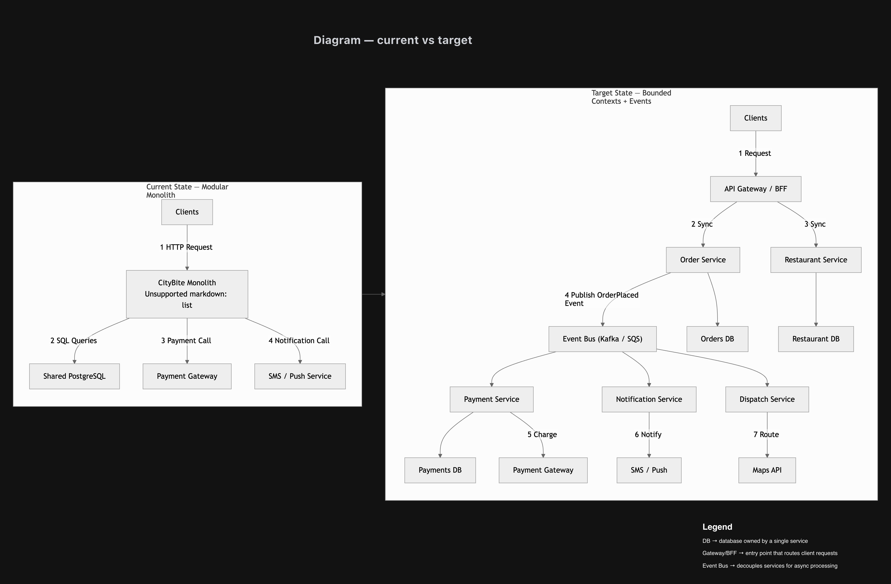

# Assignment Lecture 12 — CityBite Flexibility & Microservices

This assignment explores how CityBite can evolve from a modular monolith into a more flexible service-oriented architecture while avoiding a distributed monolith.

The submission covers:

- Bounded contexts and Conway’s Law
- Distributed monolith anti-patterns
- Database-per-service design
- API evolution strategies
- Saga-based workflows
- Strangler migration patterns
- Current vs target architecture diagrams

---

## Files Included

| File | Description |
|------|-------------|
| `part1_contexts_conway.md` | Bounded contexts and team alignment |
| `part1_distributed_monolith.md` | Distributed monolith risks and mitigations |
| `part2_database_per_service.md` | Database ownership and integration |
| `part2_api_evolution.md` | Safe API evolution strategies |
| `part2_saga_sketch.md` | Saga workflow for distributed transactions |
| `part3_strangler_plan.md` | Incremental migration strategy |
| `part3_contexts_current_vs_target.drawio` | Editable architecture diagram |
| `part3_contexts_current_vs_target.png` | Exported architecture diagram |

---

## Architecture Diagram

---

## Key Concepts Applied

- Modular Monolith
- Bounded Contexts
- Saga Pattern
- Database per Service
- API Versioning
- Branch by Abstraction
- Strangler Fig Pattern
- Event-Driven Communication

