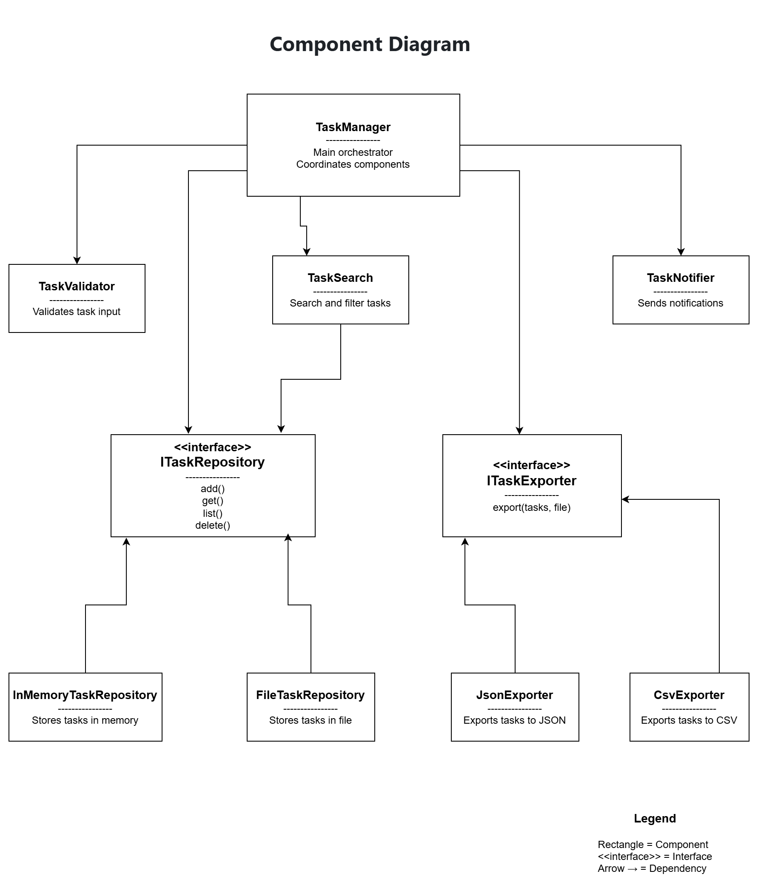

# Task Management System

## Overview
This project implements a **modular Task Management System** using software design principles such as:

- Modular architecture
- High cohesion
- Low coupling
- Dependency injection
- Single Responsibility Principle (SRP)

The system separates responsibilities into independent components, making it easier to maintain and extend.

---

## Component Diagram

The following diagram shows the architecture of the system.

---

## Main Components

- **TaskManager** – Coordinates the workflow of the system  
- **TaskValidator** – Validates task data  
- **TaskRepository** – Stores and retrieves tasks  
- **TaskSearch** – Searches and filters tasks  
- **TaskExporter** – Exports tasks to files (JSON or CSV)  
- **TaskNotifier** – Sends task reminders  

