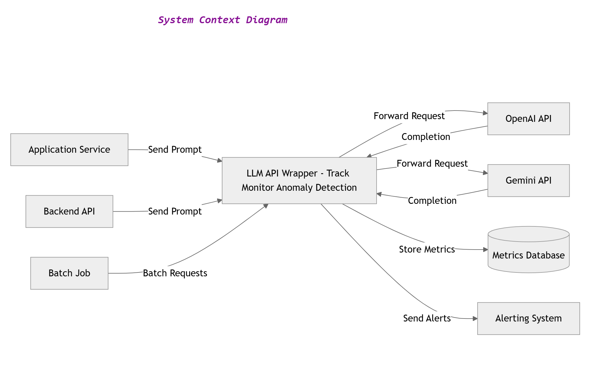
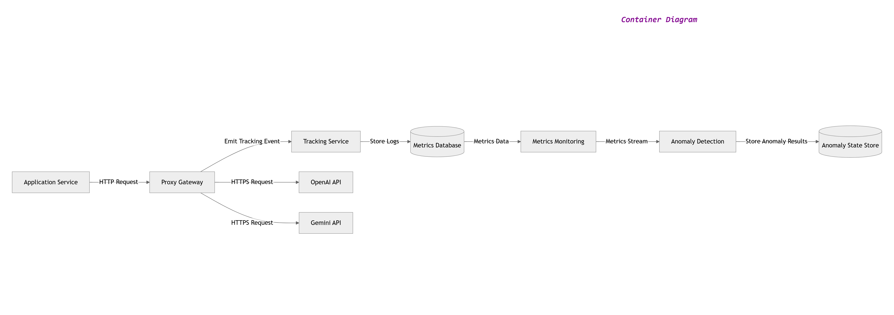
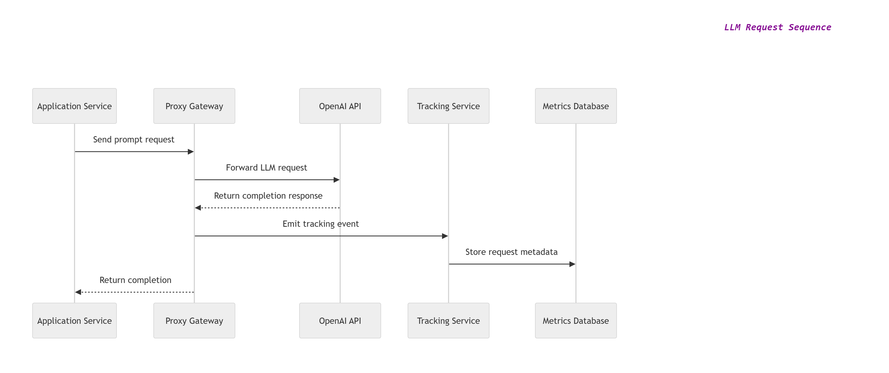
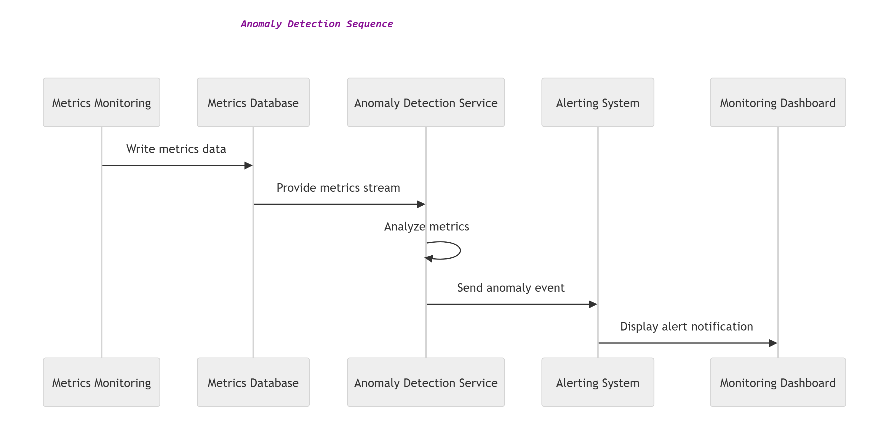

# LLM API Wrapper – Monitoring & Anomaly Detection Architecture

This project designs the architecture for a system that wraps LLM APIs such as OpenAI and Google Gemini.

The wrapper provides three key capabilities:

- Request tracking
- System monitoring
- Anomaly detection

Applications send requests to the wrapper instead of calling LLM providers directly.

---

## Architecture Overview

The system includes several containers:

- Proxy Gateway
- Tracking Service
- Metrics Monitoring Service
- Anomaly Detection Service

Supporting datastores store request metrics and anomaly results.

---

## Key Features

- Tracks LLM API usage and token consumption
- Monitors system performance metrics
- Detects abnormal behavior patterns
- Generates alerts when anomalies occur

---

## Diagrams

This repository includes several architecture diagrams:

- System Context Diagram
- Container Diagram
- Component Diagram
- Sequence Diagrams

All diagrams are provided in both `.drawio` and `.png` formats.

---

## Architecture Diagrams

### 1. System Context Diagram

### 2. Container Diagram

### 3. Proxy Gateway Component Diagram

### 4. LLM Request Sequence (Happy Path)

### 5. Anomaly Detection Sequence

