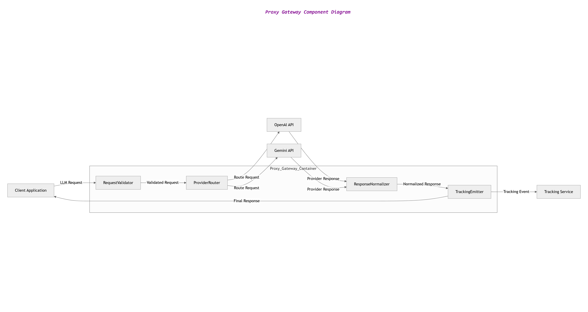

# Component Design Rationale – Proxy Gateway

This document explains the component design of the Proxy Gateway container.

The Proxy Gateway was decomposed into multiple components to achieve modularity, maintainability, and separation of concerns.

---

## Components

### 1. RequestValidator

**Responsibility**

Validates incoming API requests before they are processed.

**Validation checks**

- Required parameters
- Model availability
- Prompt size limits
- Request format correctness

**Reason for separation**

Separating validation ensures incorrect requests are rejected early, improving system reliability.

---

### 2. ProviderRouter

**Responsibility**

Determines which LLM provider should handle the request.

**Routing logic examples**

- Model-based routing
- Configuration-based routing
- Fallback routing in case of provider failure

**Reason for separation**

Routing logic may evolve independently as additional providers are added.

---

### 3. ResponseNormalizer

**Responsibility**

Converts provider-specific responses into a standardized format used by the wrapper.

**Example**

OpenAI and Gemini responses may contain different fields. The normalizer ensures a consistent response format for clients.

**Reason for separation**

This prevents client applications from needing to understand provider-specific APIs.

---

### 4. TrackingEmitter

**Responsibility**

Emits events describing each request and response to the tracking system.

**Captured data**

- Model name
- Token usage
- Request latency
- Cost estimate
- Status code

**Reason for separation**

Tracking should not interfere with request routing. Decoupling allows tracking to evolve independently.

---

## Design Principles Applied

### Single Responsibility Principle

Each component performs one clearly defined task.

### Modularity

Components can be modified or replaced independently.

### Loose Coupling

Components communicate through clear interfaces rather than shared logic.

---

## Benefits

- Easier maintenance
- Better scalability
- Improved testability
- Clear separation of concerns

---

### 3. Proxy Gateway Component Diagram
