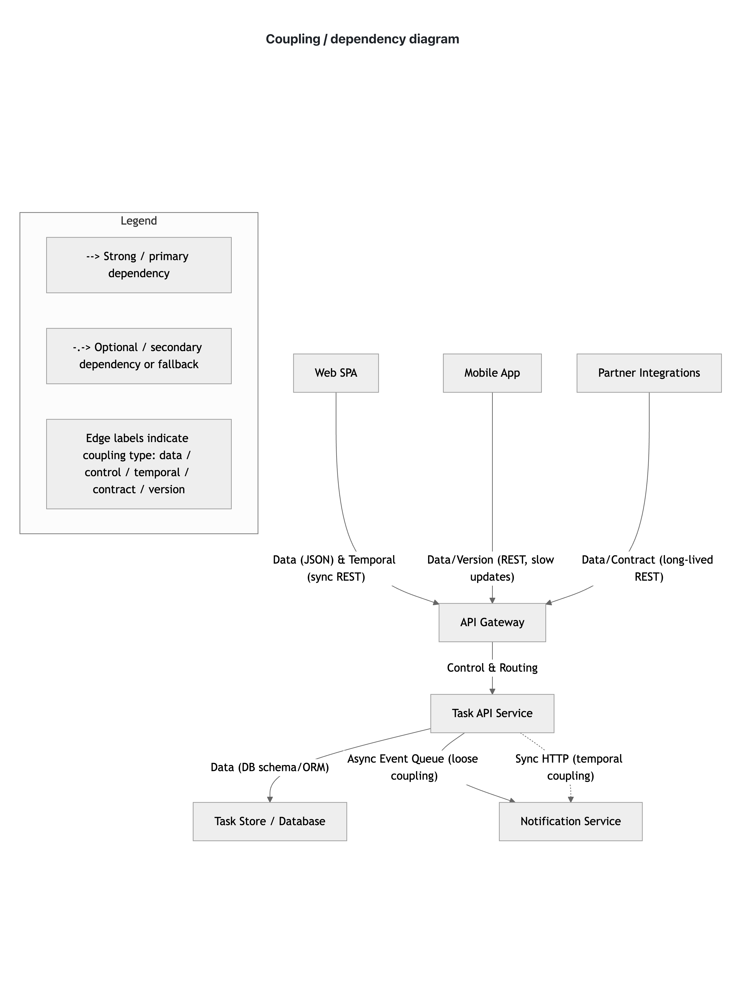
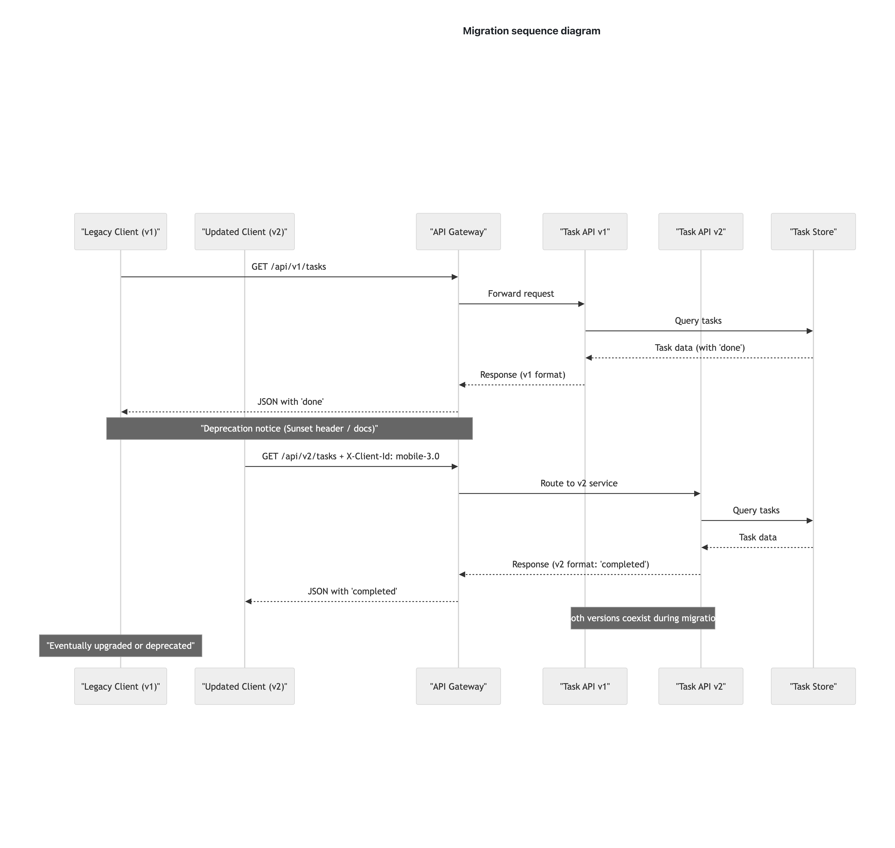

# Task Board API — Compatibility & Coupling (Assignment 8)

This document summarizes the **coupling analysis**, **compatibility/versioning**, and **migration strategy** for the Task Board API.

---

## Part 1: Coupling Analysis

**Key Components:** Web SPA, Mobile App, Partner Clients, API Gateway, Task API Service, Task Store, Notification Service.

**Observations:**

- **Tightly coupled (intentional):**  
  - Task API ↔ Task Store (schema knowledge)  
  - Web/Mobile ↔ API (strict JSON expectations)

- **Loosely coupled (reduced):**  
  - API Gateway ↔ Task API (abstract routing, version header)  
  - Notification Service ↔ Task API (async events)

**Diagram:**  
  

**Legend:**  
- **Solid arrows:** strong/data coupling  
- **Dashed arrows:** loose/temporal (async)  

---

## Part 2: Compatibility & Versioning

| Change | Breaking? | Semver | Notes |
|--------|-----------|--------|-------|
| A – Add optional `priority` | No | MINOR | Clients ignoring unknown fields work |
| B – Rename `done` → `completed` | Yes | MAJOR | Old clients fail if `done` expected |
| C – Require `X-Client-Id` | Yes | MAJOR | Requests without header rejected |
| D – Reduce `title` max length 500→100 | Yes | MAJOR | Old valid titles now fail (semantic break) |
| E – Add `POST /tasks/bulk` | No | MINOR | New endpoint; existing clients unaffected |

**Version Coexistence:**  
- Path-based (`/v1/tasks`, `/v2/tasks`)  
- Legacy clients stay on v1; new clients use v2  
- Operational cost: dual deployment, routing, documentation

---

## Part 3: Compatibility Policy

- **Additive changes:** optional fields / new endpoints → MINOR bump  
- **Breaking changes:** renamed fields, stricter validation, new required headers → MAJOR bump  
- **Deprecation:** 3–6 months notice via portal/email; sunset announced with migration guidance  
- **Error codes:** `code` stable; new codes additive only  
- **Partner integrations:** given extended notice and migration support  

**Migration / Dual-Version Flow:**  
  

**Legend:**  
- Client detects v1 sunset → switches to v2  
- Gateway routes requests based on path/version header  
- v1 and v2 run concurrently, sharing the same Task Store