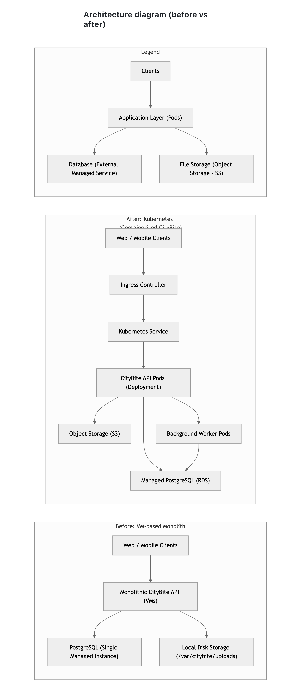
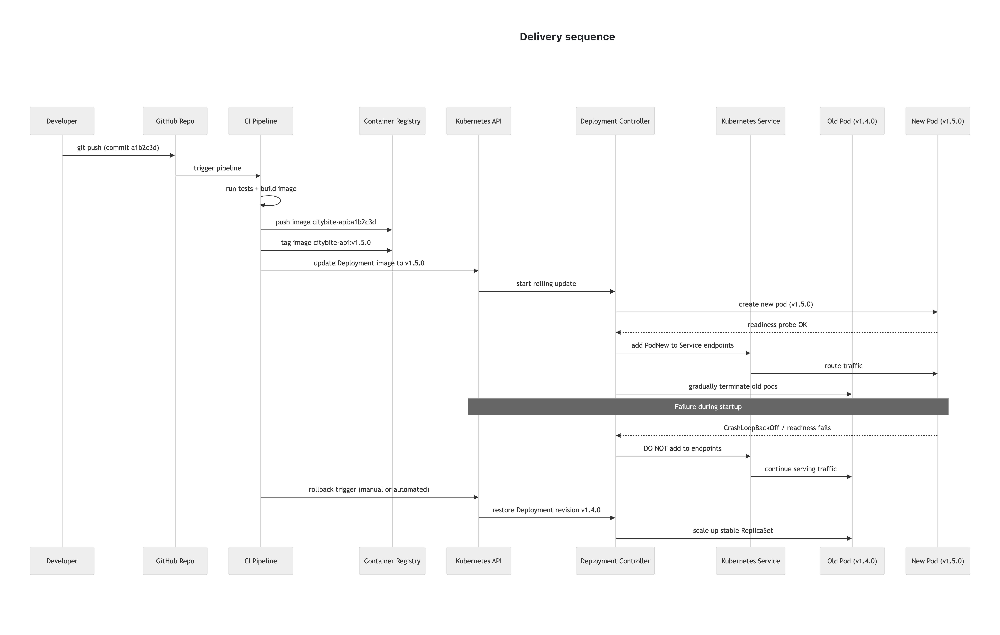

# CityBite — Kubernetes Migration (Deployability, Portability, Containers)

This project documents the migration of **CityBite** from a monolithic VM-based system to a **containerized architecture running on Kubernetes (AWS EKS)**.

The focus is on:
- Deployability
- Portability
- Container design
- Safe and reliable rollouts

---

## Part 1 — Deployability & Architecture

### 1.1 Deployability Assessment

This section analyzes key problems in the current VM-based setup:

- Snowflake servers (host drift)
- Manual SSH deployments
- Configuration stored on disk
- Local filesystem dependency for uploads
- Downtime during restarts
- Missing health checks

Each issue is paired with a **concrete Kubernetes-based solution**, such as:

- Immutable container images
- CI/CD pipelines
- Kubernetes Secrets
- Persistent or external storage
- Rolling updates
- Liveness/readiness probes

File: `part1_deployability_assessment.md`

---

### 1.2 Architecture Diagram (Before vs After)

This diagram shows:

**Before (VM-based):**
- Monolithic app on a single VM
- Local disk for uploads
- Manual deployment
- Direct connection to database

**After (Kubernetes):**
- Order API running in a Deployment (pods)
- Optional background worker
- Service + Ingress for traffic routing
- External object storage (or PVC) for uploads
- Managed PostgreSQL database

Diagram:

---

##  Part 2 — Containers & Runtime

### 2.1 Container Specification

Defines how the **Order API container** is built and executed:

- Base image: `python:3.11-slim`
- Immutable image built in CI
- Runtime configuration via environment variables:
  - `PORT`
  - `DATABASE_URL`
  - `LOG_LEVEL`
  - `AWS_REGION`
  - `DATA_DIR`
- Logs written to stdout/stderr
- One process per container

File: `part2_container_spec.md`

---

### 2.2 Health, Rollout, and Failure

Describes how Kubernetes ensures reliability:

- **Liveness probe** → restarts broken containers
- **Readiness probe** → controls traffic routing
- **Rolling updates** → zero-downtime deployments
- **Failure handling**:
  - New pods fail → no traffic
  - Old pods continue serving
- **Rollback**:
  - Restore previous version (e.g. v1.4.0)

File: `part2_health_and_rollout.md`

---

## Part 3 — Portability, Data, and Delivery

### 3.1 Portability and State

Explains how the system works across environments:

- **Menu uploads**
  - Compared: PVC vs Object Storage
  - Chosen: Object storage (e.g., S3)

- **Secrets management**
  - Kubernetes Secrets (not in images or git)

- **Database**
  - Managed PostgreSQL outside cluster
  - Connected via `DATABASE_URL`

- **Dev/Prod parity**
  - Local Docker setup mirrors production
  - Same container image everywhere

File: `part3_portability_and_state.md`

---

### 3.2 Delivery Sequence

Shows the deployment pipeline from code to running pods:

- Developer pushes code
- CI builds and tags image (git SHA → version)
- Image pushed to container registry
- Kubernetes performs rolling update
- Pods pass readiness before receiving traffic

Includes failure scenarios:
- Image pull errors
- Readiness failures
- Rollback to previous version

Diagram:

